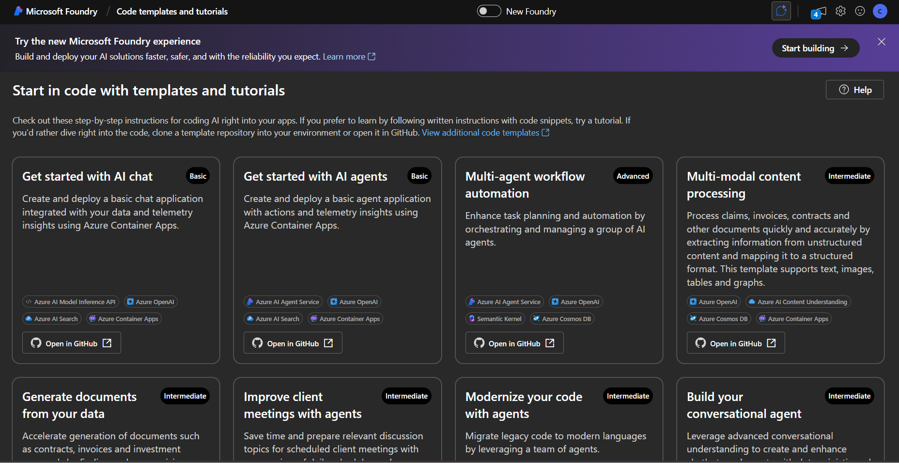
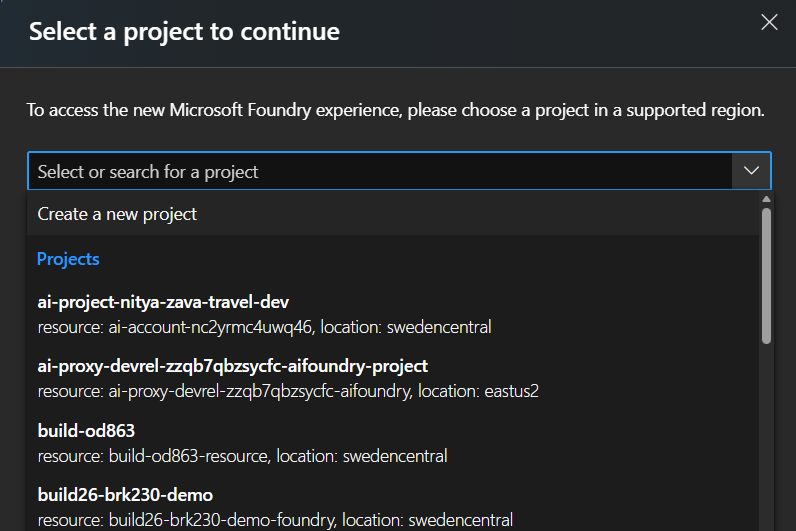

# 01 — Set Up Your Microsoft Foundry Project

## Step 1 — Open the Foundry Portal templates page

1. In your browser, navigate to [ai.azure.com/templates](https://ai.azure.com/templates).
2. Browse the available solution templates (AI chat app, AI agent app, multi-agent workflow, etc.) to see if any match your scenario. Templates provide a quick way to get started with a pre-configured project.

3. For the sake of this tutorial, click on **Start building** to create a new project from scratch. This will allow you to follow along with the step-by-step instructions and customize your project as you go.

---

## Step 2 — Create a new Microsoft Foundry project

1. In the **Select a project to continue** window, expand the dropdown and select **Create new project**. 

2. Give it a name and expand **Advanced options** to configure:
   - Azure subscription
   - Microsoft Foundry resource name
   - Region
   - Resource group name
3. Click **Create** and wait a couple of minutes for the project to be provisioned.

> [!TIP] Open the Azure portal in another tab and refresh the resource groups list. You'll see the new resource group appear with the **Foundry resource** and **Foundry project** inside it. Under the resource you can find the API key and project endpoints needed for code-first access later.

---

**Next:** [02-create-agent](../02-create-agent/README.md)
