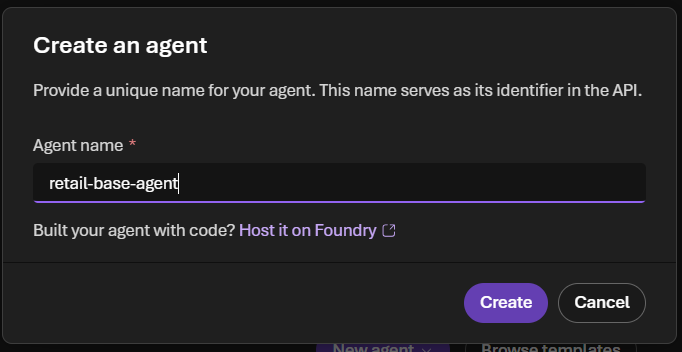
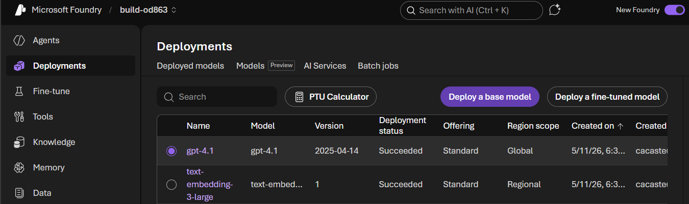
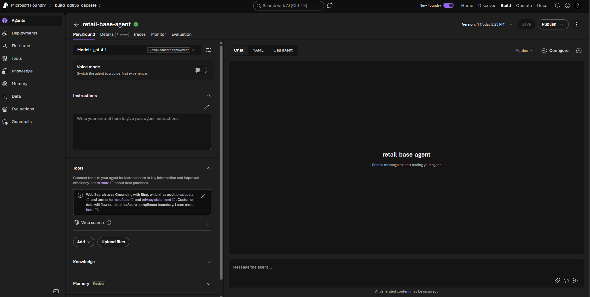
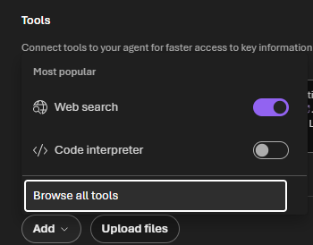
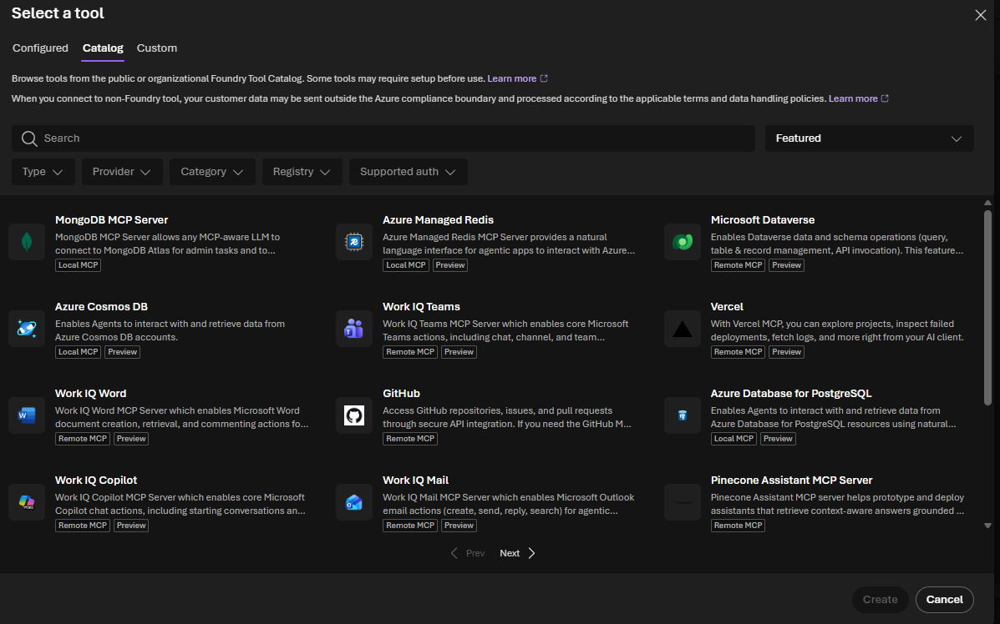

# 02 — Create Your First Agent

With your Foundry project ready, this part walks through creating the agent prototype, exploring its components in the playground, and sending the first test prompts.

---

## Step 1 — Create your first agent

1. Once the project is ready, click **Next** to proceed.
2. Then click **Create agent** when prompted to set up your first agent.
3. Enter an agent name — for this demo: `retail-base-agent`.
4. Click **Create**.

Under the hood, Foundry automatically deploys:
- **GPT-4.1** as the default chat model
- **text-embedding-3-large** for RAG / embedding scenarios
which is all you need to get started with building your agent and grounding it in your data.

> [!TIP]
> You can always check your model deployments in the **Deployments** tab in the left nav bar of your project.
>
> 

When provisioning finishes, you land in the **Agent Playground**.

---

## Step 2 — Tour the Agent Playground

In the configuration panel you can see and edit every component of the agent:

- **Model** — defaults to GPT-4.1
- **Instructions** — empty by default
- **Tools** — defaults to **Web search**; you can also add:
  - **Code Interpreter** (Python sandbox)
  - Other built-in tools from the tool catalog
  - Tools exposed by **MCP servers**. You can explore and select them by navigating to **Add**->**Browse all tools**->**Catalog**.
  
  
- **Knowledge** — connect to **Foundry IQ** to ground the agent in enterprise data (e.g., Zava IQ)
- **Memory** — persist context across sessions per user

On the right side is a **chat interface** for testing the agent.
---

## Step 3 — Test the default agent

Send two prompts in the playground chat:

1. `What can you do?` — expect a generic answer (the agent has no custom instructions yet).
2. `What paint should I use for my outdoor deck?` — expect a generic answer drawn from the model's training data + web search.

The responses confirm the agent works, but it isn't yet grounded in Zava's domain. We'll fix that in the next part by customizing instructions and connecting to custom data sources. 

---

**Previous:** [01-setup](../01-setup/README.md) · **Next:** [03-observe-and-evaluate](../03-observe-and-evaluate/README.md)
