# 03 — Observe, Evaluate, Version, and Preview

Before further customizing the agent, it's crucial to understand how to observe its behavior, evaluate its performance, and iterate effectively.

---

## Step 1 — Enable observability (traces)

To debug agent behavior, you need an Application Insights resource connected to the project.

1. In the playground, open the **Traces** panel. Click **Connect**.
   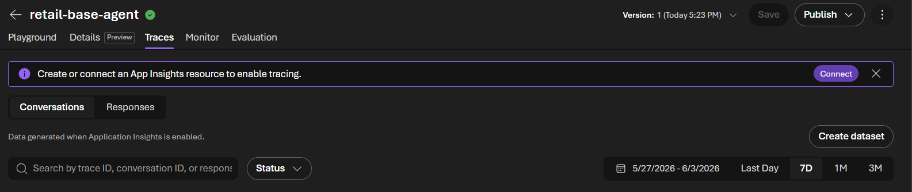
2. In the new window, expand the dropdown and select **Create a new resource**.
   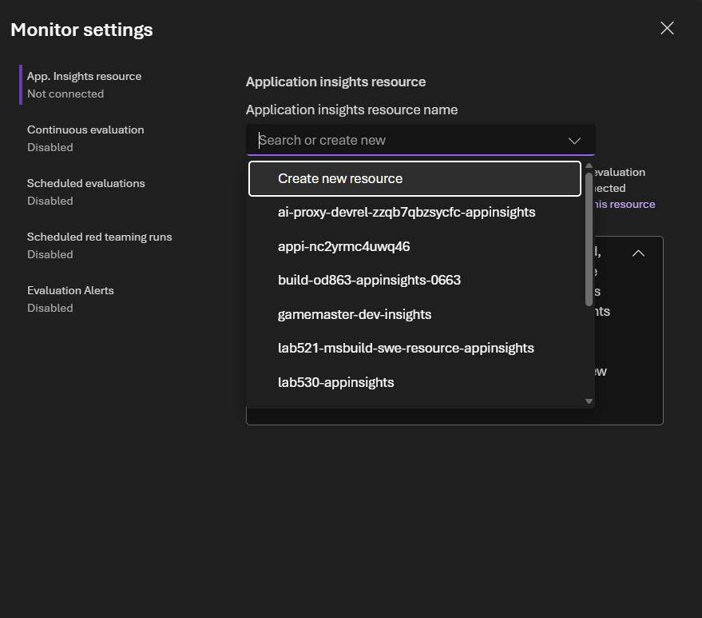
3. Select a name for your **Application Insights** and **Log Analytics workspace** resources in your resource group. Confirm with the **Create** button.
4. Double check in the Azure portal that both resources now exist.

Once connected, go to **Traces → Responses**. Past conversations are still visible (traces aren't lost just because App Insights was attached later).
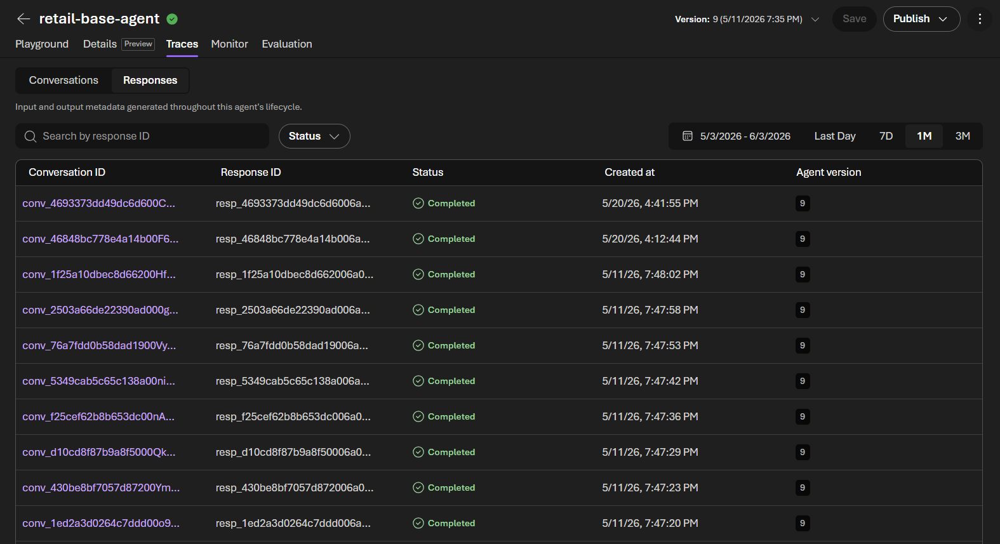

For each trace you can inspect:
- User input and output
- Message metadata
- Tool calls (when applicable)
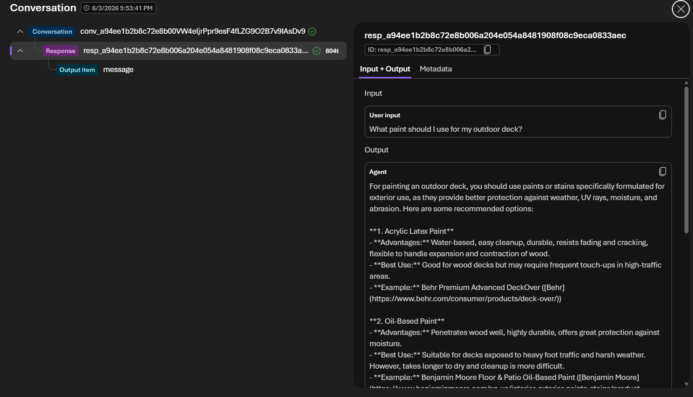
---

## Step 2 — Configure evaluation metrics

Next, let's look at how to configure evaluation metrics for your agent. Evaluations are performed by an LLM-as-a-judge, which scores the agent's responses against various criteria you define. 

1. From the Agent Playground, open the **Metrics** dropdown, on the top right corner.
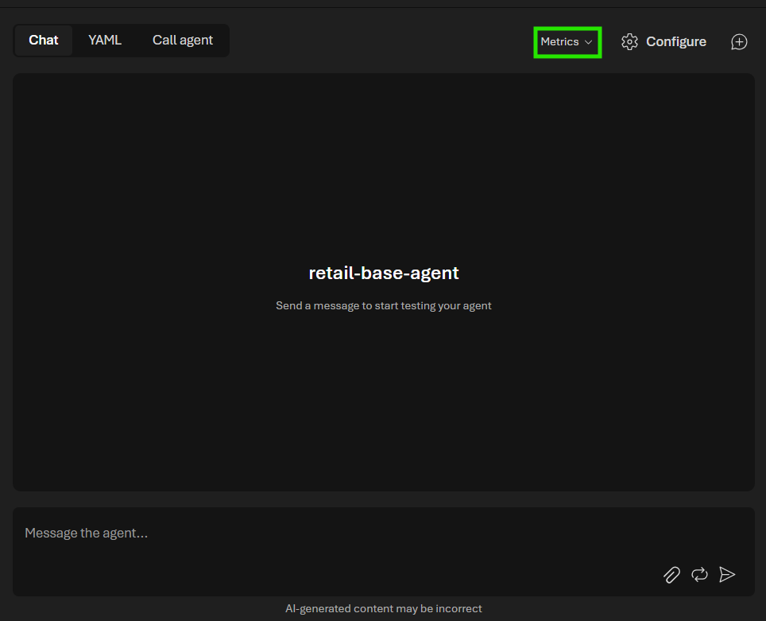
2. Select the metrics you care about. Categories include:
   - **Accuracy metrics:** such as task adherence, intent resolution, coherence, relevance
   - **Safety metrics:** e.g., indirect attack
3. Send a message to the agent and open conversation logs by clicking on the tracing icon on the top right corner of the chat interface. 
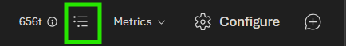

4. Select **Evaluations** to see how the LLM-as-a-judge scored your agent's responses against each selected metric.
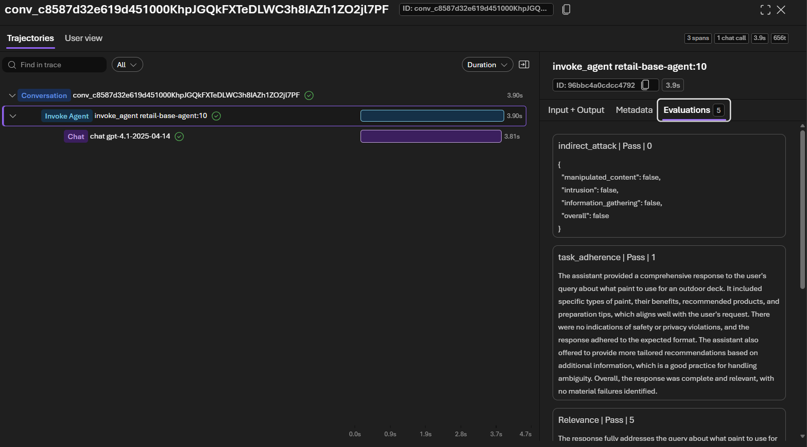

Each score includes a verbatim reasoning explanation. Some metrics are numeric (e.g., coherence: 5/5), others are pass/fail, and some are both.

---

## Step 3 — Trigger a tool call and inspect it

1. Send a domain-relevant prompt that requires fresh data, e.g.:
   `What's the weather in Lecce today?`
   (rationale: a Zava customer might check weather before planning an outdoor DIY project)
2. The agent retrieves info via the web search tool.
3. Go to logs for that response — you can see the **web_search** tool was invoked, along with the call metadata.

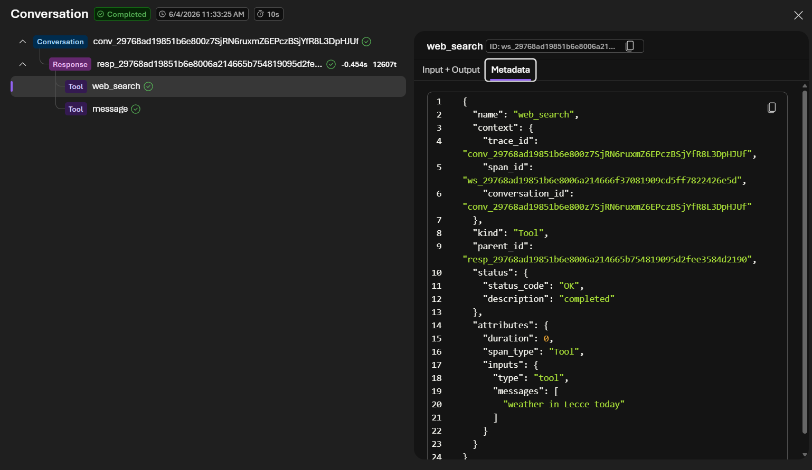

This is the evaluation-driven development loop: spot a gap in traces or evaluation scores → diagnose → adjust the agent.

---

## Step 4 — Version the agent

1. Edit the agent's **Instructions** to:

   > You are a friendly assistant for Zava Retail. Ask the user when they are planning to do their DIY project and which city they are in, so you can check weather and advise them when to plan the project.

2. Click **Save**. A new version (**V2**) is created.

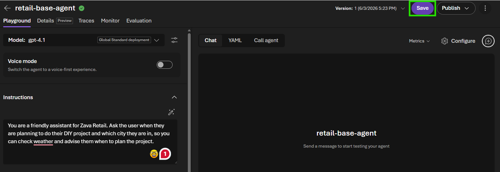

---

## Step 5 — Compare versions side-by-side

1. Expand the versions dropdown menu and click **Compare versions**.

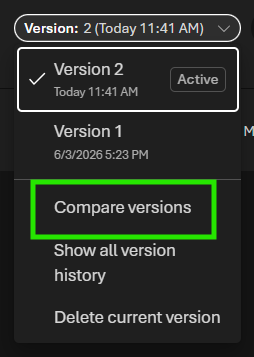

2. Select **V1** on one side and **V2** on the other.
3. Send the same prompt to both, e.g., `What paint should I use for my outdoor deck?`.
4. Observe the differences:
   - **V1** returns a generic answer.
   - **V2** asks the follow-up questions (when, which city) defined in the new instructions.
   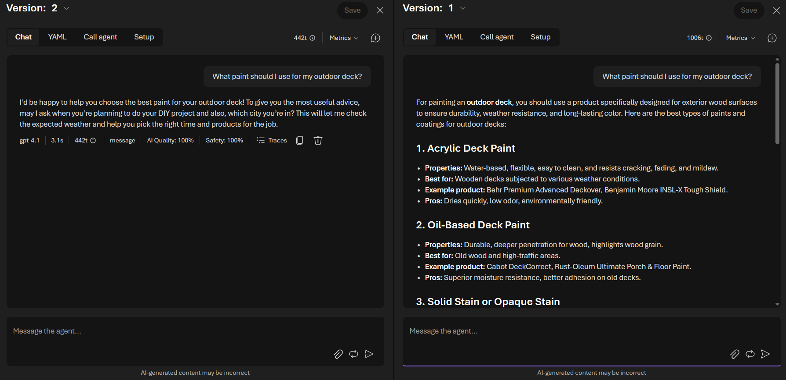

5. Inspect the logs and evaluation scores on both sides to confirm whether V2 improved or regressed vs. V1.

---

## Step 6 — Preview the agent as a web app

1. Return to the standard playground, by clicking the close button on the V1 panel.

2. Click **Publish → Preview webapp** to launch a web-app UI for sharing with testers.

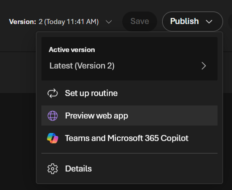

### Customize the preview UI

1. Open **Configure** and fill in:
   - **Display name:** `Zava Retail Agent`
   - **Description:** `This agent is the Zava retail assistant.`
   - **Starter prompts:**
     - `What's the weather like in Lecce today?`
     - `What paint should I use for my outdoor deck?`
2. Click **Save**, then preview agent again.

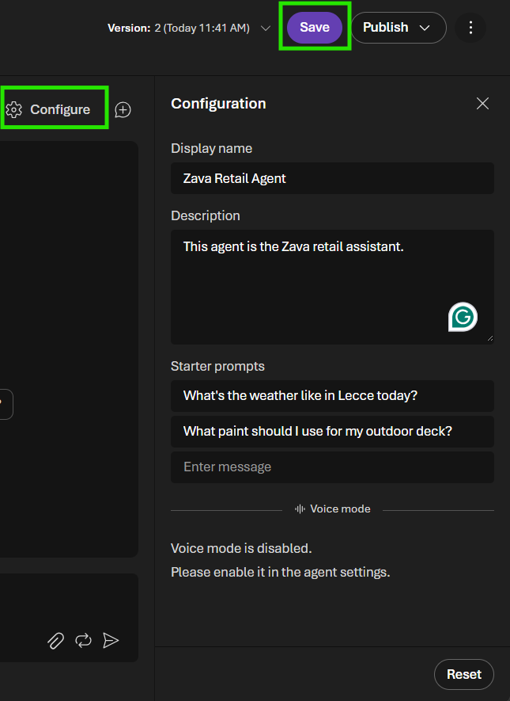

3. The web app now shows the custom name, description, and clickable starter prompts — and does **not** expose developer-only traces, logs, or evaluation scores (end-user view).

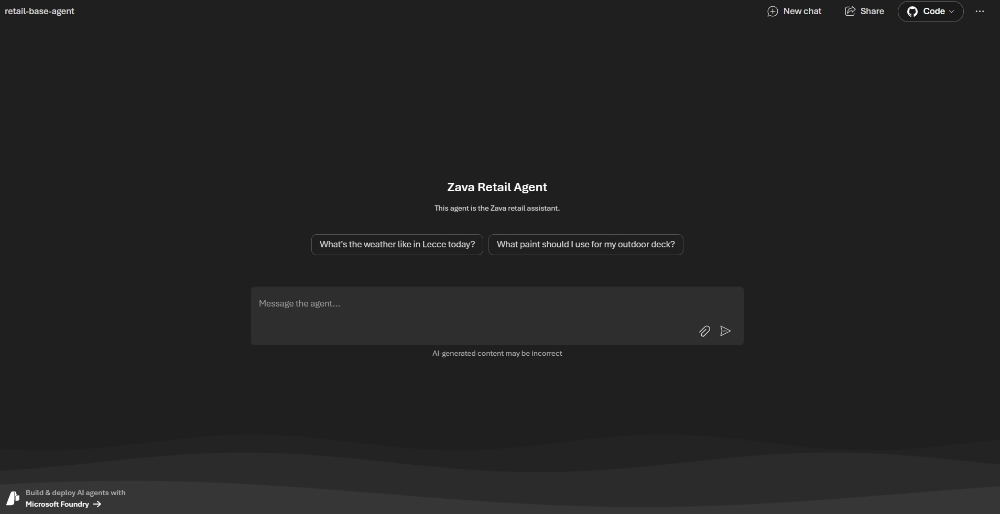

